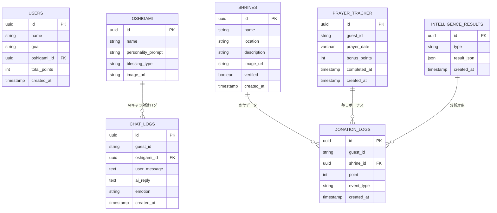
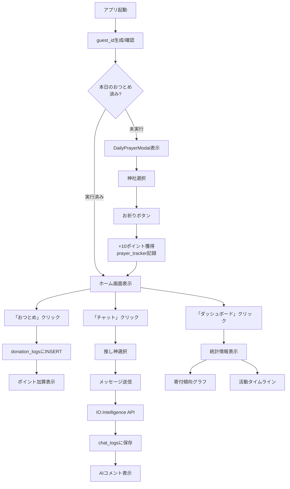

# 🧾 要件定義書 Ver.3.2

**プロダクト名:** おまモリ。
**副題:** 神社 × クリック募金 × 推し活で、「あなた」と「神社」をつなぐアプリ
**構成:** Next.js × Supabase × IO.Intelligence（ログイン後回し構成）
**作成日:** 2025年10月30日
**更新日:** 2025年11月1日（毎日のおつとめボーナス機能追加）
**作成者:** 久保 友幸（同志社大学 理工学部）

---

## 1. プロジェクト概要

「おまモリ。」は、日常の“おつとめ”や“祈り”を通じて、スポンサー拠出による寄付を促す神社支援アプリ。
Next.jsとSupabaseを基盤とし、IO.Intelligenceを用いて
**① 推し神AIチャット（人格AI）** と
**② 行動・寄付データ分析（Intelligence AI）** を実現する。

初期フェーズ（MVP）ではログイン機能を省略し、**匿名ユーザー（guest）で利用可能な体験検証** を優先する。

---

## 2. 開発方針

| 項目      | 内容                                                              |
| ------- | --------------------------------------------------------------- |
| フロントエンド | Next.js 14 (App Router) + TypeScript + Tailwind CSS + Shadcn/UI |
| バックエンド  | Supabase（DB / Storage / Edge Functions）                         |
| AI連携層   | IO.Intelligence API（キャラAI＋データ分析AI）                              |
| 認証方針    | MVPではログインを後回し。guest_idを生成し、ローカルに保持。                             |
| ホスティング  | Vercel + Supabase Cloud                                         |
| 目的      | ログイン不要で「行動 → 寄付 → 可視化」の体験を最短で実装し、AI活用の価値を検証する。                  |

---

## 3. システム構成図

```
[ユーザー]
   ↓
[Next.js Frontend]
   ├─ UI（ホーム・チャット・神社ページ）
   ├─ guest_id生成（localStorage）
   └─ API呼び出し (/api/ai-chat, /api/intelligence)
        ↓
[Supabase Backend]
   ├─ DB（users / shrines / donation_logs / chat_logs）
   ├─ Storage（画像・御朱印）
   ├─ Edge Functions（定期分析・集計）
   └─ RLS（後で導入予定）
        ↓
[IO.Intelligence API]
   ├─ モード①：キャラAI（推し神対話生成）
   └─ モード②：分析AI（行動・寄付分析）
```

---

## 4. 機能一覧

### 4.1 一般ユーザー向け（ログイン不要）

| ID   | 機能名        | 内容                 | 技術                        |
| ---- | ---------- | ------------------ | ------------------------- |
| U-01 | guest_id生成 | 初回アクセス時にUUIDを生成・保持 | localStorage + uuid       |
| U-02 | 毎日のおつとめ  | アプリ起動時にボーナスポイント +10pt | Supabase prayer_tracker    |
| U-03 | おつとめ       | 「祈る」ボタン押下でポイント加算   | Supabase DB               |
| U-04 | 推し神AIチャット  | "人格を持つ神様"との対話      | IO.Intelligence API       |
| U-05 | おみくじ       | ランダム運勢＋AIコメント生成    | IO.Intelligence API       |
| U-06 | ポイント管理     | 累計ポイント表示・ランキング     | Supabase DB               |
| U-07 | ダッシュボード    | 寄付傾向・AI分析の可視化      | Supabase + Intelligence出力 |
| U-08 | 通知（任意）     | 毎日のおつとめリマインダー      | PWAローカル通知                 |

---

### 4.2 神社管理者向け

| ID   | 機能名     | 内容          | 技術                    |
| ---- | ------- | ----------- | --------------------- |
| J-01 | 神社掲載・編集 | 写真・説明・行事を登録 | Supabase Storage + DB |
| J-02 | 支援レポート  | 寄付ポイントの集計表示 | Edge Function集計       |
| J-03 | 公開設定    | 掲載ON/OFF切替  | Supabase DB           |

---

### 4.3 運営者向け

| ID   | 機能名    | 内容                           | 技術                 |
| ---- | ------ | ---------------------------- | ------------------ |
| A-01 | データ監視  | 行動・寄付データの閲覧                  | Supabase Dashboard |
| A-02 | 分析処理   | IO.Intelligenceを呼び出して行動傾向解析  | Edge Function経由    |
| A-03 | レポート生成 | 結果を`intelligence_results`へ保存 | Supabase自動処理       |

---

## 5. IO.Intelligence API 連携仕様

### 5.1 モード①：キャラAI（推し神対話）

| 項目  | 内容                   |
| --- | -------------------- |
| 呼出先 | `/api/ai-chat`       |
| 入力  | guest_id・メッセージ・推し神属性 |
| 出力  | AI返信メッセージ・感情ラベル      |
| 保存先 | Supabase `chat_logs` |
| 目的  | 継続利用・心理的エンゲージメント向上   |

**リクエスト例**

```json
POST /api/ai-chat
{
  "guest_id": "9ac8b3e2-fc7d-4f83-b1a3-845b8a91c2fa",
  "prompt": "今日も頑張りました！",
  "oshigami": "努力の神"
}
```

**レスポンス例**

```json
{
  "reply": "素晴らしい一日ですね。あなたの頑張りは必ず報われます🌸",
  "emotion": "joy"
}
```

---

### 5.2 モード②：分析AI（行動・寄付データ分析）

| 項目   | 内容                                 |
| ---- | ---------------------------------- |
| 呼出先  | `/api/intelligence`（Edge Function） |
| 入力   | donation_logs, shrines, chat_logs  |
| 出力   | 行動傾向・寄付成長率・時間帯分析など                 |
| 保存先  | Supabase `intelligence_results`    |
| 更新頻度 | 1日1回自動（cron）                       |
| 利用目的 | 神社別寄付傾向と継続行動パターンの把握                |

**レスポンス例**

```json
{
  "top_shrine": "八坂神社",
  "growth_rate": 0.18,
  "retention": 0.73,
  "active_hours": ["07:00", "21:00"]
}
```

---

## 6. データ構造（ER図）



---

## 7. ユーザーフロー（ログインなし）



---

## 8. 非機能要件

| 分類      | 要件                                      |
| ------- | --------------------------------------- |
| 認証      | MVPでは未実装。guest_idによる匿名管理。               |
| セキュリティ  | Supabase匿名アクセス＋将来RLS導入予定。               |
| データ保持   | guest_idで行動履歴を追跡可能。                     |
| パフォーマンス | ページロード2秒以内・API応答1秒以内。                   |
| 可用性     | Supabase SLA 99.9%、自動バックアップ。            |
| UX/UI   | Shadcn/UI＋Noto Sans JPで温かみある和テイスト。      |
| AI安定性   | キャラ人格プロンプトを固定（例：励まし・癒し・学業など）。           |
| 分析更新    | Edge Functionが1日1回IO.Intelligenceを自動起動。 |

---

## 9. 開発ロードマップ

| フェーズ    | 内容                             | 状態      |
| ------- | ------------------------------ | ------- |
| Phase 1 | 🟢 guestユーザー対応MVP（おつとめ＋AIチャット） | 現在開発中   |
| Phase 2 | 🟣 IO.Intelligence連携（分析モード）    | 次段階     |
| Phase 3 | 🟤 Supabase Auth導入（ログイン機能）     | 後追加予定   |
| Phase 4 | 🟢 βテスト／神社導入／UX改善              | リリース前調整 |

---

## 10. 要約

* MVP段階では **ログイン不要（guest運用）** によりUX検証を最速化。
* **Next.js × Supabase** によりバックエンドレス構成を実現。
* **IO.Intelligence** により「人格AI」と「行動分析AI」を統合。
* フェーズごとにログイン機能・課金機能を段階追加可能な柔軟設計。

---

## 11. 開発環境セットアップ

### 11.1 前提条件

- Node.js 18+ / npm or yarn
- git
- Supabase CLI
- IO.Intelligence API キー

### 11.2 環境構築手順

**1. リポジトリクローン**
```bash
git clone https://github.com/ktomoyuki0227/omamori.git
cd omamori
```

**2. 依存パッケージインストール**
```bash
npm install
# または
yarn install
```

**3. 環境変数設定**
`.env.local` を作成し、以下を設定：
```env
# Supabase
NEXT_PUBLIC_SUPABASE_URL=https://your-project.supabase.co
NEXT_PUBLIC_SUPABASE_ANON_KEY=your-anon-key

# IO.Intelligence
NEXT_PUBLIC_IO_INTELLIGENCE_API_KEY=your-api-key
NEXT_PUBLIC_IO_INTELLIGENCE_API_URL=https://api.io-intelligence.ai

# ローカル開発フラグ
NEXT_PUBLIC_DEBUG_MODE=true
```

**4. Supabase初期セットアップ**
```bash
supabase link --project-ref your-project-ref
supabase db push
```

**5. ローカル開発サーバー起動**
```bash
npm run dev
# http://localhost:3000 にアクセス
```

---

## 12. API詳細仕様

### 12.1 キャラAI チャットAPI

**エンドポイント**
```
POST /api/ai-chat
```

**リクエストスキーマ**
```json
{
  "guest_id": "string (UUID形式)",
  "prompt": "string (ユーザーメッセージ, 最大1000文字)",
  "oshigami_id": "string (UUID形式, 推し神ID)",
  "shrine_id": "string (UUID形式, オプション)"
}
```

**レスポンススキーマ**
```json
{
  "success": true,
  "data": {
    "reply": "string (AI返信メッセージ)",
    "emotion": "string (joy|sadness|neutral|encouragement)",
    "blessing": "string (オプション：御朱印コメント)",
    "timestamp": "ISO8601形式"
  },
  "error": null
}
```

**エラーレスポンス**
```json
{
  "success": false,
  "error": {
    "code": "string (INVALID_GUEST_ID|API_RATE_LIMIT|IO_ERROR)",
    "message": "string"
  }
}
```

---

### 12.2 おつとめ（寄付）API

**エンドポイント**
```
POST /api/donation
```

**リクエストスキーマ**
```json
{
  "guest_id": "string (UUID)",
  "shrine_id": "string (UUID)",
  "point": "number (1-100)",
  "event_type": "string (prayer|blessing|visit)"
}
```

**レスポンススキーマ**
```json
{
  "success": true,
  "data": {
    "donation_id": "string (UUID)",
    "total_points": "number (累計ポイント)",
    "message": "string (お礼メッセージ)"
  }
}
```

---

### 12.3 分析API（Intelligence）

**エンドポイント**
```
POST /api/intelligence
```

**リクエストスキーマ**
```json
{
  "guest_id": "string (UUID)",
  "analysis_type": "string (behavior|donation_trend|retention)"
}
```

**レスポンススキーマ**
```json
{
  "success": true,
  "data": {
    "top_shrine": "string (最も寄付した神社)",
    "growth_rate": "number (成長率, 0.0-1.0)",
    "retention": "number (継続率, 0.0-1.0)",
    "active_hours": ["string (ISO時刻)"],
    "recommendations": ["string"]
  }
}
```

---

### 12.4 レート制限

| API             | 制限値           | リセット    |
| --------------- | --------------- | ------- |
| `/api/ai-chat`  | 30回/時間/ユーザー | 1時間ごと   |
| `/api/donation` | 100回/日/ユーザー | 00:00 UTC |
| `/api/intelligence` | 1回/日/ユーザー   | 00:00 UTC |

---

## 13. Supabase データベース初期化

### 13.1 マイグレーション実行

`supabase/migrations/` 配下に以下のSQLファイルを配置：

**001_create_base_tables.sql** （テーブル作成）
```sql
-- ユーザー（guest）テーブル
CREATE TABLE users (
  id UUID PRIMARY KEY DEFAULT gen_random_uuid(),
  guest_id VARCHAR(36) UNIQUE NOT NULL,
  oshigami_id UUID REFERENCES oshigami(id),
  total_points INTEGER DEFAULT 0,
  created_at TIMESTAMP WITH TIME ZONE DEFAULT NOW(),
  updated_at TIMESTAMP WITH TIME ZONE DEFAULT NOW()
);

-- 推し神テーブル
CREATE TABLE oshigami (
  id UUID PRIMARY KEY DEFAULT gen_random_uuid(),
  name VARCHAR(100) NOT NULL,
  personality_prompt TEXT NOT NULL,
  blessing_type VARCHAR(50),
  image_url TEXT,
  created_at TIMESTAMP WITH TIME ZONE DEFAULT NOW()
);

-- 神社テーブル
CREATE TABLE shrines (
  id UUID PRIMARY KEY DEFAULT gen_random_uuid(),
  name VARCHAR(100) NOT NULL,
  location VARCHAR(255),
  description TEXT,
  image_url TEXT,
  verified BOOLEAN DEFAULT FALSE,
  created_at TIMESTAMP WITH TIME ZONE DEFAULT NOW()
);

-- 寄付ログテーブル
CREATE TABLE donation_logs (
  id UUID PRIMARY KEY DEFAULT gen_random_uuid(),
  guest_id VARCHAR(36) NOT NULL,
  shrine_id UUID REFERENCES shrines(id),
  point INTEGER NOT NULL DEFAULT 1,
  event_type VARCHAR(50) DEFAULT 'prayer',
  created_at TIMESTAMP WITH TIME ZONE DEFAULT NOW()
);

-- チャットログテーブル
CREATE TABLE chat_logs (
  id UUID PRIMARY KEY DEFAULT gen_random_uuid(),
  guest_id VARCHAR(36) NOT NULL,
  oshigami_id UUID REFERENCES oshigami(id),
  user_message TEXT NOT NULL,
  ai_reply TEXT NOT NULL,
  emotion VARCHAR(50),
  created_at TIMESTAMP WITH TIME ZONE DEFAULT NOW()
);

-- 分析結果テーブル
CREATE TABLE intelligence_results (
  id UUID PRIMARY KEY DEFAULT gen_random_uuid(),
  guest_id VARCHAR(36),
  analysis_type VARCHAR(50),
  result_json JSONB NOT NULL,
  created_at TIMESTAMP WITH TIME ZONE DEFAULT NOW()
);

-- インデックス作成（パフォーマンス最適化）
CREATE INDEX idx_donation_logs_guest_id ON donation_logs(guest_id);
CREATE INDEX idx_donation_logs_shrine_id ON donation_logs(shrine_id);
CREATE INDEX idx_chat_logs_guest_id ON chat_logs(guest_id);
CREATE INDEX idx_intelligence_results_guest_id ON intelligence_results(guest_id);
```

### 13.2 ダミーデータ投入

**002_seed_dummy_data.sql** （初期データ）
```sql
-- 推し神データ
INSERT INTO oshigami (name, personality_prompt, blessing_type, image_url) VALUES
('努力の神', '励ましの言葉で応援する。常にポジティブ。', 'success', '/images/oshigami/1.png'),
('癒しの神', '優しく寄り添い、心を落ち着かせる。', 'healing', '/images/oshigami/2.png'),
('学問の神', '知識を広げることを勧める。知的好奇心を刺激する。', 'knowledge', '/images/oshigami/3.png'),
('恋愛の神', 'ロマンティックで前向き。幸せを応援する。', 'love', '/images/oshigami/4.png');

-- 神社データ
INSERT INTO shrines (name, location, description, verified) VALUES
('八坂神社', '京都府京都市東山区', '祇園祭で有名。縁結びと厄除けの神社。', true),
('伏見稲荷大社', '京都府京都市伏見区', '商売繁盛と家内安全。朱い鳥居が有名。', true),
('厳島神社', '広島県廿日市市', '宮島にある世界遺産。海上の鳥居が有名。', true),
('明治神宮', '東京都渋谷区', '明治天皇を祀る。初詣で多くの参拝者が訪れる。', true);
```

実行方法：
```bash
supabase db push
```

---

## 14. 開発コマンド

### 14.1 ビルド・実行

```bash
# 開発サーバー起動
npm run dev

# 本番ビルド
npm run build

# 本番環境で起動
npm start

# Linting
npm run lint

# 型チェック
npm run type-check
```

### 14.2 Supabase関連

```bash
# ローカル開発環境起動
supabase start

# ローカル環境停止
supabase stop

# データベースマイグレーション確認
supabase status

# リモート環境にプッシュ
supabase db push
```

---

## 15. デプロイ方法

### 15.1 Vercelへのデプロイ

**初回セットアップ**
```bash
npm install -g vercel
vercel login
vercel
```

**環境変数設定（Vercelダッシュボード）**
- `NEXT_PUBLIC_SUPABASE_URL`
- `NEXT_PUBLIC_SUPABASE_ANON_KEY`
- `NEXT_PUBLIC_IO_INTELLIGENCE_API_KEY`

**デプロイ実行**
```bash
vercel deploy --prod
```

### 15.2 Supabaseクラウド環境

- Supabase公式サイト（https://supabase.com）でプロジェクト作成
- CLI で紐づけ：`supabase link --project-ref xxx`
- マイグレーション実行：`supabase db push`

---

## 16. デモ実装チェックリスト

デモレベルの実装完了目安：

- [ ] guest_id生成・localStorage保持機能
- [ ] ホーム画面UI実装（Shadcn/UI）
- [ ] 「おつとめ」ボタン実装 → donation_logs INSERT
- [ ] 推し神AIチャット実装 → `/api/ai-chat` 連携
- [ ] ダッシュボード画面（累計ポイント・ランキング表示）
- [ ] `/api/intelligence` 連携（基本的な分析結果表示）
- [ ] Supabase接続確認・ダミーデータ確認
- [ ] Vercel デプロイ成功
- [ ] ローカルテスト完了（E2E動作確認）

---

## 17. トラブルシューティング

### Q: `NEXT_PUBLIC_SUPABASE_ANON_KEY` が無効なエラーが出る

**A:** `.env.local` を再確認し、Supabaseダッシュボード → Settings → API で正しいキーをコピー。

### Q: `npm run dev` が起動しない

**A:** 
```bash
# キャッシュクリア
rm -r .next node_modules
npm install
npm run dev
```

### Q: IO.Intelligence API が応答しない

**A:** 
- API_KEY を確認
- API ドキュメント（提供予定）で仕様を再確認
- Network タブで実際のリクエスト/レスポンス確認

### Q: Supabase マイグレーション実行で SQL エラー

**A:**
```bash
# エラーログ詳細確認
supabase db pull  # 最新スキーマをローカルに同期
```

---

## 18. 参考リンク

- [Next.js 公式ドキュメント](https://nextjs.org/docs)
- [Supabase ドキュメント](https://supabase.com/docs)
- [Shadcn/UI コンポーネント集](https://ui.shadcn.com)
- [IO.Intelligence API ドキュメント](https://docs.io-intelligence.ai)（準備中）

---

## 19. デモ実装完了概要

### ✅ 実装済み機能

**フロントエンド**
- ✓ ホーム画面（Navigation, Hero, HomeCard）
- ✓ おつとめ（祈り・寄付）ページ（PrayerCard, DonationForm）
- ✓ 推し神AIチャット（ChatWindow, ChatMessage, ChatInput, OshigamiSelector）
- ✓ ダッシュボード（StatsCard, DonationChart, ActivityTimeline）
- ✓ guest_id 生成・localStorage 保存
- ✓ Tailwind CSS + グラデーションデザイン

**データ管理**
- ✓ localStorage を使用したローカルデータ永続化
- ✓ ポイント管理・寄付ログ保存
- ✓ チャット履歴保存
- ✓ 推し神選択状態の保存

**プロジェクト構成**
- ✓ Next.js 14 (App Router) プロジェクト初期化
- ✓ TypeScript + ESLint 設定
- ✓ Tailwind CSS 設定
- ✓ パス エイリアス設定（@/* imports）
- ✓ Git ブランチ管理（feature/fix/deploy ブランチ運用）

### 🚀 次のステップ

1. **Supabase 連携** → localStorage から Supabase へ移行
2. **IO.Intelligence API** → モック応答から実API連携へ
3. **認証機能** → Supabase Auth 導入
4. **Vercel デプロイ** → 本番環境リリース
5. **E2E テスト** → Cypress/Playwright でテスト自動化
6. **PWA対応** → Service Worker でオフライン対応

### 📦 プロジェクトファイル構成

```
omamori/
├── src/
│   ├── app/
│   │   ├── layout.tsx
│   │   ├── page.tsx
│   │   ├── prayer/
│   │   ├── chat/
│   │   └── dashboard/
│   ├── components/
│   │   ├── Navigation.tsx
│   │   ├── home/
│   │   ├── prayer/
│   │   ├── chat/
│   │   └── dashboard/
│   ├── lib/
│   │   ├── env.ts
│   │   ├── supabase.ts
│   │   └── utils.ts
│   ├── types/
│   │   └── index.ts
│   └── styles/
│       └── globals.css
├── public/
│   └── images/
├── package.json
├── tsconfig.json
├── tailwind.config.js
├── next.config.js
├── vercel.json
└── README.md
```

### 🎯 デモアクセス

```bash
# ローカル開発環境
npm run dev
# http://localhost:3000

# 本番ビルド確認
npm run build
npm start
```

---

## 20. 開発チームノート

**作成日:** 2025年10月30日
**初期開発版:** Ver.0.1.0 (デモレベル)
**対応ブランチ:** main, feature/*, setup/*, deploy/*

**このバージョンの目的:**
- デモンストレーション用アプリケーション
- ユーザー体験（UX）の初期検証
- AI統合の可能性実証
- 段階的なスケーリング可能な設計

**今後の改善予定:**
- リアルタイム通知機能
- 多言語対応
- アクセシビリティ改善（WCAG 2.1）
- パフォーマンス最適化

---

## 13. Supabaseスキーマ & SQL

以下は、Supabase PostgreSQLデータベースに実行するべきSQL一式です。

### 13.1 prayer_tracker テーブル（毎日のおつとめボーナス用）

```sql
-- prayer_trackerテーブル作成
CREATE TABLE IF NOT EXISTS prayer_tracker (
  id UUID PRIMARY KEY DEFAULT gen_random_uuid(),
  guest_id VARCHAR(36) NOT NULL,
  prayer_date VARCHAR(10) NOT NULL,
  bonus_points INTEGER DEFAULT 10,
  completed_at TIMESTAMP WITH TIME ZONE NOT NULL,
  created_at TIMESTAMP WITH TIME ZONE DEFAULT NOW(),
  CONSTRAINT unique_guest_prayer_date UNIQUE(guest_id, prayer_date)
);

-- インデックス作成（クエリ性能最適化）
CREATE INDEX IF NOT EXISTS idx_prayer_tracker_guest_id 
  ON prayer_tracker(guest_id);
CREATE INDEX IF NOT EXISTS idx_prayer_tracker_prayer_date 
  ON prayer_tracker(prayer_date);
CREATE INDEX IF NOT EXISTS idx_prayer_tracker_guest_date 
  ON prayer_tracker(guest_id, prayer_date);

-- RLS有効化
ALTER TABLE prayer_tracker ENABLE ROW LEVEL SECURITY;

-- RLSポリシー
CREATE POLICY prayer_tracker_select_all 
  ON prayer_tracker FOR SELECT 
  USING (TRUE);

CREATE POLICY prayer_tracker_insert_all 
  ON prayer_tracker FOR INSERT 
  WITH CHECK (TRUE);

CREATE POLICY prayer_tracker_update_all 
  ON prayer_tracker FOR UPDATE 
  USING (TRUE);

CREATE POLICY prayer_tracker_delete_all 
  ON prayer_tracker FOR DELETE 
  USING (TRUE);
```

### 13.2 既存テーブルの確認

その他のテーブルが未作成の場合、以下も実行してください：

```sql
-- usersテーブル（ゲストユーザー管理）
CREATE TABLE IF NOT EXISTS users (
  id UUID PRIMARY KEY DEFAULT gen_random_uuid(),
  created_at TIMESTAMP WITH TIME ZONE DEFAULT NOW(),
  updated_at TIMESTAMP WITH TIME ZONE DEFAULT NOW()
);

-- oshigami テーブル（推し神マスタ）
CREATE TABLE IF NOT EXISTS oshigami (
  id SERIAL PRIMARY KEY,
  name VARCHAR(255) NOT NULL,
  personality_prompt TEXT,
  created_at TIMESTAMP WITH TIME ZONE DEFAULT NOW()
);

-- shrines テーブル（神社マスタ）
CREATE TABLE IF NOT EXISTS shrines (
  id SERIAL PRIMARY KEY,
  name VARCHAR(255) NOT NULL,
  created_at TIMESTAMP WITH TIME ZONE DEFAULT NOW()
);

-- donation_logs テーブル（寄付・ポイント記録）
CREATE TABLE IF NOT EXISTS donation_logs (
  id UUID PRIMARY KEY DEFAULT gen_random_uuid(),
  guest_id UUID NOT NULL,
  shrine_id INTEGER,
  point INTEGER NOT NULL DEFAULT 1,
  event_type VARCHAR(50) DEFAULT 'donation',
  prayer_reason TEXT,
  created_at TIMESTAMP WITH TIME ZONE DEFAULT NOW(),
  FOREIGN KEY (guest_id) REFERENCES users(id)
);
  prayer_reason TEXT,
  created_at TIMESTAMP WITH TIME ZONE DEFAULT NOW(),
  FOREIGN KEY (guest_id) REFERENCES users(id)
);

-- chat_logs テーブル（AIチャット履歴）
CREATE TABLE IF NOT EXISTS chat_logs (
  id UUID PRIMARY KEY DEFAULT gen_random_uuid(),
  guest_id UUID NOT NULL,
  oshigami_id INTEGER NOT NULL,
  user_message TEXT NOT NULL,
  ai_response TEXT NOT NULL,
  created_at TIMESTAMP WITH TIME ZONE DEFAULT NOW(),
  FOREIGN KEY (guest_id) REFERENCES users(id),
  FOREIGN KEY (oshigami_id) REFERENCES oshigami(id)
);

-- intelligence_results テーブル（AI分析結果キャッシュ）
CREATE TABLE IF NOT EXISTS intelligence_results (
  id UUID PRIMARY KEY DEFAULT gen_random_uuid(),
  guest_id UUID NOT NULL,
  analysis_type VARCHAR(50),
  result_json JSONB,
  created_at TIMESTAMP WITH TIME ZONE DEFAULT NOW(),
  FOREIGN KEY (guest_id) REFERENCES users(id)
);
```

### 13.2.1 donation_logs テーブルと RLS ポリシー

**⚠️ 重要: 既存の donation_logs テーブルが存在する場合は、以下を実行して削除してから再作成してください：**

```sql
DROP TABLE IF EXISTS donation_logs CASCADE;
```

その後、以下の SQL を Supabase SQL Editor で実行してください：

```sql
-- donation_logs テーブル（寄付・ポイント記録）
CREATE TABLE IF NOT EXISTS donation_logs (
  id UUID PRIMARY KEY DEFAULT gen_random_uuid(),
  guest_id UUID NOT NULL,
  shrine_id INTEGER,
  point INTEGER NOT NULL DEFAULT 1,
  event_type VARCHAR(50) DEFAULT 'donation',
  prayer_reason TEXT,
  created_at TIMESTAMP WITH TIME ZONE DEFAULT NOW(),
  FOREIGN KEY (guest_id) REFERENCES users(id)
);

-- インデックス
CREATE INDEX IF NOT EXISTS idx_donation_logs_guest_id ON donation_logs(guest_id);
CREATE INDEX IF NOT EXISTS idx_donation_logs_shrine_id ON donation_logs(shrine_id);

-- RLS (Row Level Security) ポリシー
ALTER TABLE donation_logs ENABLE ROW LEVEL SECURITY;

-- 全員が SELECT できる（匿名ユーザーも含む）
CREATE POLICY donation_logs_select_all 
  ON donation_logs FOR SELECT 
  USING (TRUE);

-- 全員が INSERT できる（匿名ユーザーも含む）
CREATE POLICY donation_logs_insert_all 
  ON donation_logs FOR INSERT 
  WITH CHECK (TRUE);

-- 全員が UPDATE できる（匿名ユーザーも含む）
CREATE POLICY donation_logs_update_all 
  ON donation_logs FOR UPDATE 
  USING (TRUE);

-- 全員が DELETE できる（匿名ユーザーも含む）
CREATE POLICY donation_logs_delete_all 
  ON donation_logs FOR DELETE 
  USING (TRUE);
```

### 13.3 初期データ挿入（オプション）

```sql
-- oshigami（推し神） サンプルデータ
INSERT INTO oshigami (name, personality_prompt) VALUES
  ('稲荷大明神', 'あなたは商売繁盛と豊かさの神です。ユーザーを励まし、事業成功をサポートします。'),
  ('天照大神', 'あなたは太陽と光の神です。明るく前向きなアドバイスをします。'),
  ('恵比寿神', 'あなたは福の神です。楽しく、フレンドリーにユーザーをサポートします。')
ON CONFLICT DO NOTHING;

-- shrines（神社） サンプルデータ
INSERT INTO shrines (name) VALUES
  ('伏見稲荷大社'),
  ('伊勢神宮'),
  ('出雲大社'),
  ('厳島神社')
ON CONFLICT DO NOTHING;
```

---

## 14. 開発環境セットアップ

### 14.1 必要なツール
- Node.js v18.17以上
- npm or yarn
- Supabaseプロジェクト（無料プランOK）
- IO.Intelligenceアカウント（APIキー）

### 14.2 ローカル実行

```bash
# リポジトリクローン
git clone https://github.com/ktomo/omamori.git
cd omamori

# 依存パッケージインストール
npm install

# 環境変数設定（.env.local.exampleをコピーして編集）
cp .env.local.example .env.local
# 以下の値を .env.local に設定:
# - NEXT_PUBLIC_SUPABASE_URL
# - NEXT_PUBLIC_SUPABASE_ANON_KEY
# - NEXT_PUBLIC_IO_INTELLIGENCE_API_KEY
# - NEXT_PUBLIC_IO_INTELLIGENCE_API_URL

# 開発サーバー起動
npm run dev

# ブラウザで http://localhost:3000 を開く
```

### 14.3 本番デプロイ（Vercel推奨）

```bash
# Vercelプロジェクト初期化
vercel

# 環境変数をVercelに設定
vercel env add NEXT_PUBLIC_SUPABASE_URL
vercel env add NEXT_PUBLIC_SUPABASE_ANON_KEY
vercel env add NEXT_PUBLIC_IO_INTELLIGENCE_API_KEY
vercel env add NEXT_PUBLIC_IO_INTELLIGENCE_API_URL

# デプロイ
vercel --prod
```

---

## 15. トラブルシューティング

| 問題                           | 原因                      | 解決方法                                     |
| ---------------------------- | ----------------------- | ------------------------------------------ |
| `npm run dev` エラー            | .env.localが未設定          | `.env.local.example` をコピーして環境変数を設定 |
| Supabase接続エラー              | ANON_KEYが無効           | Supabaseダッシュボードで確認・再設定            |
| 毎日のおつとめが表示されない       | prayer_trackerテーブル未作成 | セクション13.1のSQLを実行してテーブル作成       |
| AIチャット応答がない            | IO.Intelligence API未設定   | APIキーとURLを確認、.env.localを再設定        |
| ポイント加算されない             | donation_logsテーブル未作成  | セクション13.2のSQLを実行してテーブル作成       |

````
