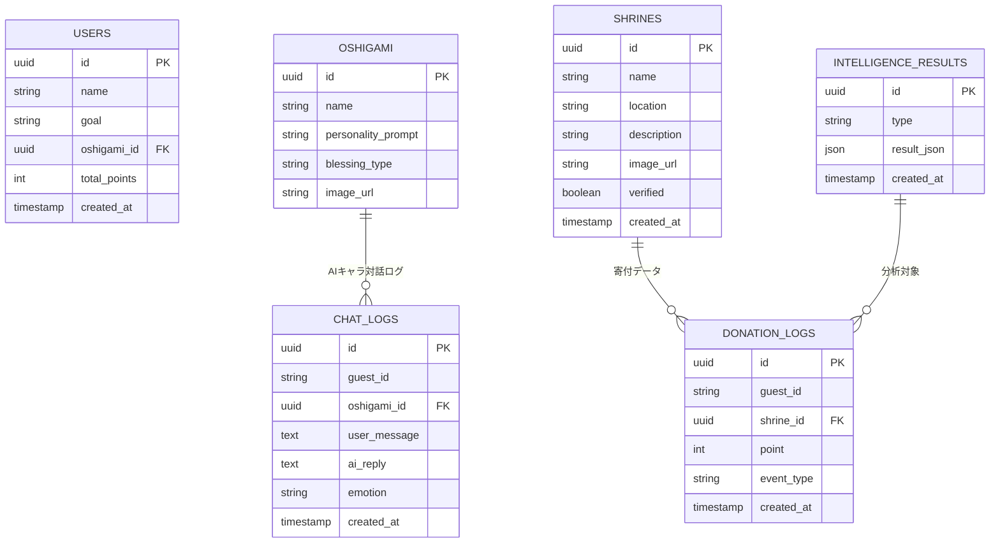

# 🧾 要件定義書 Ver.3.1

**プロダクト名:** おまモリ。
**副題:** 神社 × クリック募金 × 推し活で、「あなた」と「神社」をつなぐアプリ
**構成:** Next.js × Supabase × IO.Intelligence（ログイン後回し構成）
**作成日:** 2025年10月30日
**作成者:** 久保 友幸（同志社大学 理工学部）

---

## 1. プロジェクト概要

「おまモリ。」は、日常の“おつとめ”や“祈り”を通じて、スポンサー拠出による寄付を促す神社支援アプリ。
Next.jsとSupabaseを基盤とし、IO.Intelligenceを用いて
**① 推し神AIチャット（人格AI）** と
**② 行動・寄付データ分析（Intelligence AI）** を実現する。

初期フェーズ（MVP）ではログイン機能を省略し、**匿名ユーザー（guest）で利用可能な体験検証** を優先する。

---

## 2. 開発方針

| 項目      | 内容                                                              |
| ------- | --------------------------------------------------------------- |
| フロントエンド | Next.js 14 (App Router) + TypeScript + Tailwind CSS + Shadcn/UI |
| バックエンド  | Supabase（DB / Storage / Edge Functions）                         |
| AI連携層   | IO.Intelligence API（キャラAI＋データ分析AI）                              |
| 認証方針    | MVPではログインを後回し。guest_idを生成し、ローカルに保持。                             |
| ホスティング  | Vercel + Supabase Cloud                                         |
| 目的      | ログイン不要で「行動 → 寄付 → 可視化」の体験を最短で実装し、AI活用の価値を検証する。                  |

---

## 3. システム構成図

```
[ユーザー]
   ↓
[Next.js Frontend]
   ├─ UI（ホーム・チャット・神社ページ）
   ├─ guest_id生成（localStorage）
   └─ API呼び出し (/api/ai-chat, /api/intelligence)
        ↓
[Supabase Backend]
   ├─ DB（users / shrines / donation_logs / chat_logs）
   ├─ Storage（画像・御朱印）
   ├─ Edge Functions（定期分析・集計）
   └─ RLS（後で導入予定）
        ↓
[IO.Intelligence API]
   ├─ モード①：キャラAI（推し神対話生成）
   └─ モード②：分析AI（行動・寄付分析）
```

---

## 4. 機能一覧

### 4.1 一般ユーザー向け（ログイン不要）

| ID   | 機能名        | 内容                 | 技術                        |
| ---- | ---------- | ------------------ | ------------------------- |
| U-01 | guest_id生成 | 初回アクセス時にUUIDを生成・保持 | localStorage + uuid       |
| U-02 | おつとめ       | 「祈る」ボタン押下でポイント加算   | Supabase DB               |
| U-03 | 推し神AIチャット  | “人格を持つ神様”との対話      | IO.Intelligence API       |
| U-04 | おみくじ       | ランダム運勢＋AIコメント生成    | IO.Intelligence API       |
| U-05 | ポイント管理     | 累計ポイント表示・ランキング     | Supabase DB               |
| U-06 | ダッシュボード    | 寄付傾向・AI分析の可視化      | Supabase + Intelligence出力 |
| U-07 | 通知（任意）     | 毎日のおつとめリマインダー      | PWAローカル通知                 |

---

### 4.2 神社管理者向け

| ID   | 機能名     | 内容          | 技術                    |
| ---- | ------- | ----------- | --------------------- |
| J-01 | 神社掲載・編集 | 写真・説明・行事を登録 | Supabase Storage + DB |
| J-02 | 支援レポート  | 寄付ポイントの集計表示 | Edge Function集計       |
| J-03 | 公開設定    | 掲載ON/OFF切替  | Supabase DB           |

---

### 4.3 運営者向け

| ID   | 機能名    | 内容                           | 技術                 |
| ---- | ------ | ---------------------------- | ------------------ |
| A-01 | データ監視  | 行動・寄付データの閲覧                  | Supabase Dashboard |
| A-02 | 分析処理   | IO.Intelligenceを呼び出して行動傾向解析  | Edge Function経由    |
| A-03 | レポート生成 | 結果を`intelligence_results`へ保存 | Supabase自動処理       |

---

## 5. IO.Intelligence API 連携仕様

### 5.1 モード①：キャラAI（推し神対話）

| 項目  | 内容                   |
| --- | -------------------- |
| 呼出先 | `/api/ai-chat`       |
| 入力  | guest_id・メッセージ・推し神属性 |
| 出力  | AI返信メッセージ・感情ラベル      |
| 保存先 | Supabase `chat_logs` |
| 目的  | 継続利用・心理的エンゲージメント向上   |

**リクエスト例**

```json
POST /api/ai-chat
{
  "guest_id": "9ac8b3e2-fc7d-4f83-b1a3-845b8a91c2fa",
  "prompt": "今日も頑張りました！",
  "oshigami": "努力の神"
}
```

**レスポンス例**

```json
{
  "reply": "素晴らしい一日ですね。あなたの頑張りは必ず報われます🌸",
  "emotion": "joy"
}
```

---

### 5.2 モード②：分析AI（行動・寄付データ分析）

| 項目   | 内容                                 |
| ---- | ---------------------------------- |
| 呼出先  | `/api/intelligence`（Edge Function） |
| 入力   | donation_logs, shrines, chat_logs  |
| 出力   | 行動傾向・寄付成長率・時間帯分析など                 |
| 保存先  | Supabase `intelligence_results`    |
| 更新頻度 | 1日1回自動（cron）                       |
| 利用目的 | 神社別寄付傾向と継続行動パターンの把握                |

**レスポンス例**

```json
{
  "top_shrine": "八坂神社",
  "growth_rate": 0.18,
  "retention": 0.73,
  "active_hours": ["07:00", "21:00"]
}
```

---

## 6. データ構造（ER図）



---

## 7. ユーザーフロー（ログインなし）

```mermaid
flowchart TD

A[初回アクセス] --> B[guest_id生成(localStorage)]
B --> C[ホーム画面表示]
C --> D1[「おつとめ」クリック]
C --> D2[推し神AIチャット開始]

D1 --> E1[donation_logsにINSERT]
E1 --> F1[Supabaseでポイント加算]
F1 --> G1[Edge Functionで分析トリガー]
G1 --> H1[IO.Intelligence分析結果保存]

D2 --> E2[メッセージ送信→/api/ai-chat]
E2 --> F2[IO.IntelligenceキャラAI応答]
F2 --> G2[chat_logsに保存]
G2 --> H2[チャット画面に反映]

H1 & H2 --> I[ダッシュボード表示]
I --> J1[寄付傾向・支援ランキング]
I --> J2[行動パターン分析]
I --> J3[神社別レポート]
```

---

## 8. 非機能要件

| 分類      | 要件                                      |
| ------- | --------------------------------------- |
| 認証      | MVPでは未実装。guest_idによる匿名管理。               |
| セキュリティ  | Supabase匿名アクセス＋将来RLS導入予定。               |
| データ保持   | guest_idで行動履歴を追跡可能。                     |
| パフォーマンス | ページロード2秒以内・API応答1秒以内。                   |
| 可用性     | Supabase SLA 99.9%、自動バックアップ。            |
| UX/UI   | Shadcn/UI＋Noto Sans JPで温かみある和テイスト。      |
| AI安定性   | キャラ人格プロンプトを固定（例：励まし・癒し・学業など）。           |
| 分析更新    | Edge Functionが1日1回IO.Intelligenceを自動起動。 |

---

## 9. 開発ロードマップ

| フェーズ    | 内容                             | 状態      |
| ------- | ------------------------------ | ------- |
| Phase 1 | 🟢 guestユーザー対応MVP（おつとめ＋AIチャット） | 現在開発中   |
| Phase 2 | 🟣 IO.Intelligence連携（分析モード）    | 次段階     |
| Phase 3 | 🟤 Supabase Auth導入（ログイン機能）     | 後追加予定   |
| Phase 4 | 🟢 βテスト／神社導入／UX改善              | リリース前調整 |

---

## 10. 要約

* MVP段階では **ログイン不要（guest運用）** によりUX検証を最速化。
* **Next.js × Supabase** によりバックエンドレス構成を実現。
* **IO.Intelligence** により「人格AI」と「行動分析AI」を統合。
* フェーズごとにログイン機能・課金機能を段階追加可能な柔軟設計。
